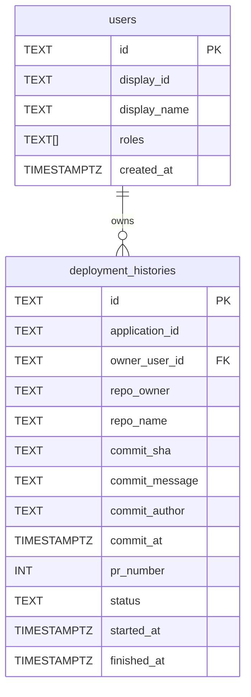

# DB

## ER図

```mermaid
erDiagram
    users {
        TEXT id PK
        TEXT display_id
        TEXT display_name
        TEXT[] roles
        TIMESTAMPTZ created_at
    }

    deployment_histories {
        TEXT id PK
        TEXT application_id
        TEXT owner_user_id FK
        TEXT repo_owner
        TEXT repo_name
        TEXT commit_sha
        TEXT commit_message
        TEXT commit_author
        TIMESTAMPTZ commit_at
        INT pr_number
        TEXT status
        TIMESTAMPTZ started_at
        TIMESTAMPTZ finished_at
    }

    users ||--o{ deployment_histories : "owns"
```
